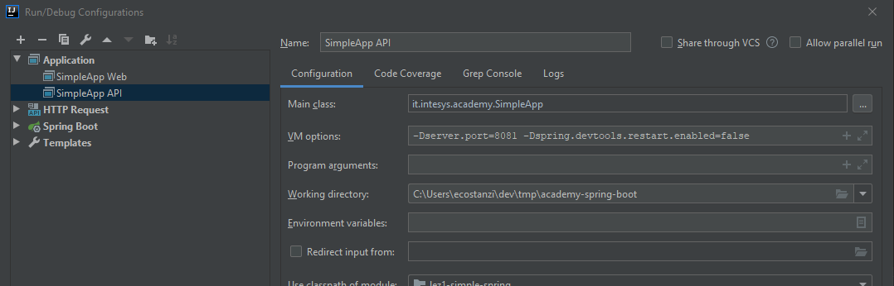
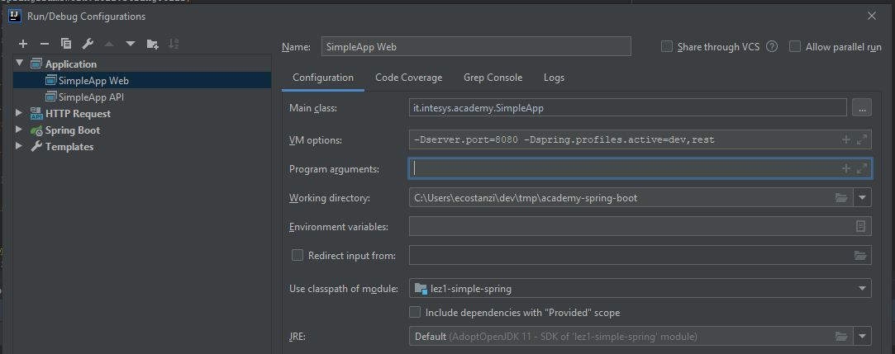

# Lezione 4 - Spring Boot & REST API

## Setup

1. Aggiornare il codice facendo un git fetch dalla directory del repository 
   ```
   git fetch
   ```
1. Spostarsi sul commit di inizio lezione:
   ```
   git checkout :/'IASB4 cleanup and start'
   ```

### Esercizio 1 - Rest Controllers

Aggiungere 2 nuovi endpoint REST a alla classe `PatientRestController.java`

```java
@GetMapping("/patients/{patientId}")
public Patient getPatient(@PathVariable("patientId") Long patientId) {
    logger.info("Retrieving patient with id {}", patientId);
    return patientService.getPatient(patientId);
}

@GetMapping("/patients/count")
public Counter countPatients() {
    return new Counter(patientService.countPatients());
}
```

---

Creare il nuovo controller `ExaminationRestController.java` e creare 2 endpoint rest:
- `@GetMapping("/patients/{patientId}/examinations")` per la lista degli esami del paziente 
- `@PostMapping("/examinations")` per creare un nuovo esame. (hint: usare `@RequestBody` invece di `@ModelAttribute`)

---

Disabilitare la security per tutti gli endpoint che iniziano con `/api`, modificando il file SecurityConfiguration.java.

Aggiungere un nuovo antmatcher alla configurazione esistente.

```java
.antMatchers("/", "/css/**", "/js/**" , "/login", "/logout").permitAll()
.antMatchers("/api/**").permitAll()
```

---

Creare una nuova configurazione su intellij e far partire l'applicazione spring sulla porta 8081, disabilitando il restart automatico.

`-Dserver.port=8081 -Dspring.devtools.restart.enabled=false`



Verificare che l'applicazione risponda con un json andando su http://localhost:8081/api/patients/1


### Esercizio 2 - Rest Client e RestTemplate

Aggiungere una property Stringa `apiEndpoint` (con getter e setter) alla classe `ApplicationProperties.java`.

Aggiungere la property all'`application-dev.yml` in modo che punti all'applicazione spring configurata nell'esercizio 1:

```java
application:
  api-endpoint: http://localhost:8081/api
```

---

Creare una classe `RestConfiguration.java` e configurare `JDBCTemplate.java`

```java
@Configuration
public class RestConfiguration {

    private final ApplicationProperties applicationProperties;

    public RestConfiguration(ApplicationProperties applicationProperties) {
        this.applicationProperties = applicationProperties;
    }

    @Bean
    public RestTemplate restTemplate(RestTemplateBuilder restTemplateBuilder) {
        return restTemplateBuilder
                .rootUri(applicationProperties.getApiEndpoint())
                .build();
    }
}
```

---

Creare una nuova implementazione di patientDAO `PatientRestDAO.java` che utilizzi RESTTemplate.

Attenzione: `PatientJDBCDao` e `PatientRestDAO` implementano la stessa interfaccia. 
Le annotation `@Primary` e `@Profile` servono per fare in modo che questo componente venga scelto al posto di 
`PatientJDBCDao` nel caso in cui il profilo (spring.profiles.active) `rest` sia attivo.

```java
@Component
@Primary
@Profile("rest")
public class PatientRestDao implements PatientDao {

    private static Logger logger = LoggerFactory.getLogger(PatientRestDao.class);

    private final RestTemplate restTemplate;

    public PatientRestDao(RestTemplate restTemplate) {
        this.restTemplate = restTemplate;
    }

    @Override
    public Patient findById(Long patientId) {
        logger.info("Fetching patient {} via REST APIs", patientId);
        return restTemplate.getForObject("/patients/{patientId}", Patient.class, patientId);
    }

    @Override
    public List<Patient> searchPatient(String patientString) {
        logger.info("Searchin patient {} via REST APIs", patientString);
        Patient[] patients = restTemplate.getForObject("/patients/search?search={searchString}",
                Patient[].class, patientString);
        return Arrays.asList(patients);
    }


    @Override
    public int countPatients() {
        logger.info("Counting patients via REST APIs");
        Counter counter = restTemplate.getForObject("/patients/count", Counter.class);
        return counter.getCount();
    }
}

```

Creare una nuova implementazione di examinationDAO `ExaminationRestDAO.java` che utilizzi RestTemplate.

```java
@Component
@Primary
@Profile("rest")
public class ExaminationRestDao implements ExaminationDao {

    private static Logger logger = LoggerFactory.getLogger(ExaminationRestDao.class);
    
    //todo
}

```

---

**Senza spegnere l'applicazione gia' attiva sulla porta 8081** lanciare una nuova istanza dell'applicazione sulla
porta 8080, attivando il profilo `rest`.

`-Dserver.port=8080 -Dspring.profiles.active=dev,rest`



aprire l'applicazione su http://localhost:8080 e navigare per verificare il flusso 


BROWSER --> app sulla porta 8080 --> API sulla porta 8081 --> Database

---

### Esercizio 3 - OpenAPI generator (Server Side)

Creare il file [api.yml](src/main/resources/api.yml) in `src/main/resources/api.yml` .

Per visualizzare le API definite nel file, copiare il contenuto su https://editor.swagger.io.

---

Modificare il pom.xml e inserire questo plugin nella sezione `plugins`.

```xml
<plugin>
    <groupId>org.openapitools</groupId>
    <artifactId>openapi-generator-maven-plugin</artifactId>
    <version>4.2.3</version>
    <executions>
        <execution>
            <id>server</id>
            <goals>
                <goal>generate</goal>
            </goals>
            <configuration>
                <inputSpec>${project.basedir}/src/main/resources/api.yml</inputSpec>
                <generatorName>spring</generatorName>
                <apiPackage>it.intesys.academy.web.api</apiPackage>
                <modelPackage>it.intesys.academy.web.api.model</modelPackage>
                <supportingFilesToGenerate>ApiUtil.java</supportingFilesToGenerate>
                <modelNameSuffix>ApiDTO</modelNameSuffix>
                <configOptions>
                    <delegatePattern>true</delegatePattern>
                    <useTags>true</useTags>
                    <title>wardapp</title>
                    <serializableModel>true</serializableModel>
                </configOptions>
                <!-- tells swagger codegen to use instant instead of OffsetDateTime -->
                <typeMappings>
                    <typeMapping>OffsetDateTime=Instant</typeMapping>
                </typeMappings>
                <importMappings>
                    <importMapping>java.time.OffsetDateTime=java.time.Instant</importMapping>
                </importMappings>

            </configuration>
        </execution>
    </executions>
</plugin>
```

Aggiungere le dipendenze:
```xml
 <dependency>
    <groupId>io.swagger</groupId>
    <artifactId>swagger-annotations</artifactId>
    <version>1.6.0</version>
</dependency>

<dependency>
    <groupId>org.openapitools</groupId>
    <artifactId>jackson-databind-nullable</artifactId>
    <version>0.2.0</version>
</dependency>
```
---

Da terminale lanciare il comando `./mvnw clean compile` e controllare nella cartella `target/generated-sources` 
il codice generato.

---

Eliminare le classi `PatientRestController` e `ExaminationRestController`. Creare al loro posto

```java
@Service
public class PatientApiDelegateImpl implements PatientApiDelegate {
  
    // implementare i metodi dell'interfaccia
    
    private PatientApiDTO toPatientApiDTO(Patient patient) {
        return new PatientApiDTO()
                .id(patient.getId())
                .birthDate(patient.getBirthDate())
                .firstName(patient.getFirstName())
                .lastName(patient.getLastName())
                .fiscalCode(patient.getFiscalCode());

    }
}
```

```java
@Service
public class ExaminationApiDelegateImpl implements ExaminationApiDelegate {
  
    // implementare i metodi dell'interfaccia
    
     private ExaminationApiDTO toExaminationApiDTO(Examination examination) {
        return new ExaminationApiDTO()
                .diastolicPressure(examination.getDiastolicPressure())
                .examinationDate(examination.getExaminationDate().toInstant())
                .height(examination.getHeight())
                .weight(examination.getWeight())
                .systolicPressure(examination.getSystolicPressure())
                .patientId((long) examination.getPatientId());

    }

    private Examination toExamination(ExaminationApiDTO examinationApiDTO) {
        Examination examination = new Examination();
        examination.setDiastolicPressure(examinationApiDTO.getDiastolicPressure());
        examination.setExaminationDate(OffsetDateTime.ofInstant(examinationApiDTO.getExaminationDate(), ZoneId.systemDefault()));
        examination.setHeight(examinationApiDTO.getHeight());
        examination.setWeight(examinationApiDTO.getWeight());
        examination.setPatientId(Math.toIntExact(examinationApiDTO.getPatientId()));;
        examination.setSystolicPressure(examinationApiDTO.getSystolicPressure());
        return examination;
    }

}
```

---

Riavviare il servizio sulla porta 8081 e riprovare a navigare su http://localhost:8080.

### Esercizio 4 - OpenAPI generator (Client Side)

In questo esercizio il codice per fare chiamate Rest verra' generato dal plugin maven di openapi.
Non è quindi necessario utilizzare direttamente `RestTemplate` ma si potranno usare delle interfacce 
generate

---

Modificare il pom e inserire questa execution.

```xml
<execution>
    <id>openapi-client</id>
    <goals>
        <goal>generate</goal>
    </goals>
    <configuration>
        <inputSpec>${project.basedir}/src/main/resources/api.yml</inputSpec>
        <generatorName>java</generatorName>
        <library>resttemplate</library>
        <apiPackage>it.intesys.academy.api.client.api</apiPackage>
        <modelPackage>it.intesys.academy.api.client.model</modelPackage>
        <generateApiDocumentation>false</generateApiDocumentation>
        <modelNameSuffix>ClientDTO</modelNameSuffix>
        <generateApiTests>false</generateApiTests>
        <generateModelTests>false</generateModelTests>
        <supportingFilesToGenerate>ApiClient.java,Authentication.java,HttpBasicAuth.java,HttpBearerAuth.java,ApiKeyAuth.java,RFC3339DateFormat.java</supportingFilesToGenerate>
        <configOptions>
            <title>wardapp-client</title>
            <sourceFolder>src/gen/java/main</sourceFolder>
            <dateLibrary>java8</dateLibrary>
        </configOptions>
        <typeMappings>
            <typeMapping>OffsetDateTime=Instant</typeMapping>
        </typeMappings>
        <importMappings>
            <importMapping>java.time.OffsetDateTime=java.time.Instant</importMapping>
        </importMappings>
    </configuration>
</execution>
``` 

e questa dipendenza.

```xml
 <dependency>
    <groupId>com.google.code.findbugs</groupId>
    <artifactId>jsr305</artifactId>
    <version>3.0.2</version>
</dependency>
```

---

Da terminale lanciare il comando `./mvnw clean compile` e controllare nella cartella `target/generated-sources` 
il codice **client** generato.

---

Modificare `RestConfiguration`

```java
@Bean
public RestTemplate restTemplate1(RestTemplateBuilder restTemplateBuilder) {
    return restTemplateBuilder.build();
}

@Bean
public ApiClient apiClient(RestTemplate restTemplate) {
    ApiClient apiClient = new ApiClient(restTemplate);
    apiClient.setBasePath(applicationProperties.getApiEndpoint());
    return apiClient;
}
```
---

Modificare `ExaminationRestDao` e `PatientRestDao` in modo che usino le API Generate invece di RestTemplate


```java
@Component
@Primary
@Profile("rest")
public class ExaminationRestDao implements ExaminationDao {

    private static Logger logger = LoggerFactory.getLogger(ExaminationRestDao.class);

    private final ExaminationsApi examinationsApi;

    public ExaminationRestDao(ExaminationsApi examinationsApi) {
        this.examinationsApi = examinationsApi;
    }

    // todo reimplementare i metodi
``` 

```java
@Component
@Primary
@Profile("rest")
public class PatientRestDao implements PatientDao {

    private static Logger logger = LoggerFactory.getLogger(PatientRestDao.class);

    private final PatientApi patientApi;

    public PatientRestDao(PatientApi patientApi) {
        this.patientApi = patientApi;
    }

    //todo reimplementare i metodi
```

---

Riavviare il servizio sulla porta 8080 e riprovare a navigare su http://localhost:8080.

---


### Esercizio 5 - Distributed Tracing

Aggiungere una dipendenza al `pom.xml`.

```xml
<dependency>
    <groupId>org.springframework.cloud</groupId>
    <artifactId>spring-cloud-starter-sleuth</artifactId>
    <version>2.2.1.RELEASE</version>
</dependency>
```

Riavviare i 2 servizi (quello sulla 8080  e quello sulla 8081) e osservare i log.

`2020-02-19 16:45:14.438  INFO [,f190a7e9529ea7e6,f190a7e9529ea7e6,false] 3480 --- [nio-8080-exec-1] i.i.academy.patient.PatientRestDao       : Fetching patient 2 via REST APIs`

`2020-02-19 16:45:14.442  INFO [,f190a7e9529ea7e6,d5cdd3d90080b24d,false] 13792 --- [nio-8081-exec-6] i.i.academy.patient.PatientJdcbDao       : Fetching patient 2 via JDBCTemplate`

Qualcosa di interessante in `[,f190a7e9529ea7e6,d5cdd3d90080b24d,false]`?

### Esercizio 5 (Bonus)

Scaricare [ngrok](https://ngrok.com/download), estrarlo e lanciare `./ngrok http 8081`.

Le vostre API sono ora raggiungibili dall'esterno tramite l'url visualizzato da ngrok.
 
- Comunicare l'endpoint a un vicino in modo che modifichi la configurazione in `application-dev.yml`
- Aprire il proprio browser all'indirizzo http://localhost:4040
- Chiedere al vicino di navigare sulla web app http://localhost:8080
